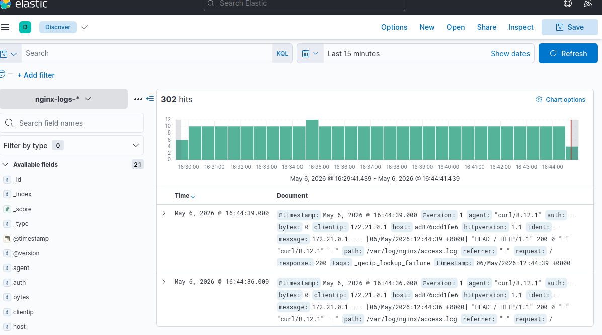
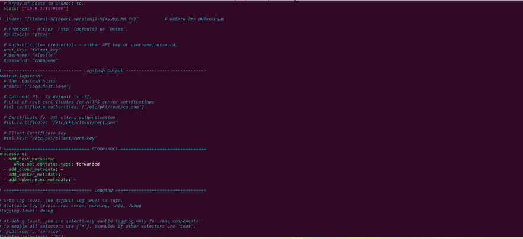
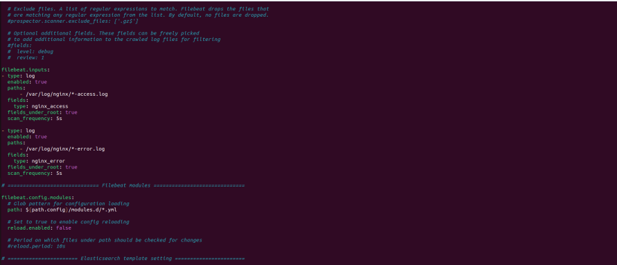
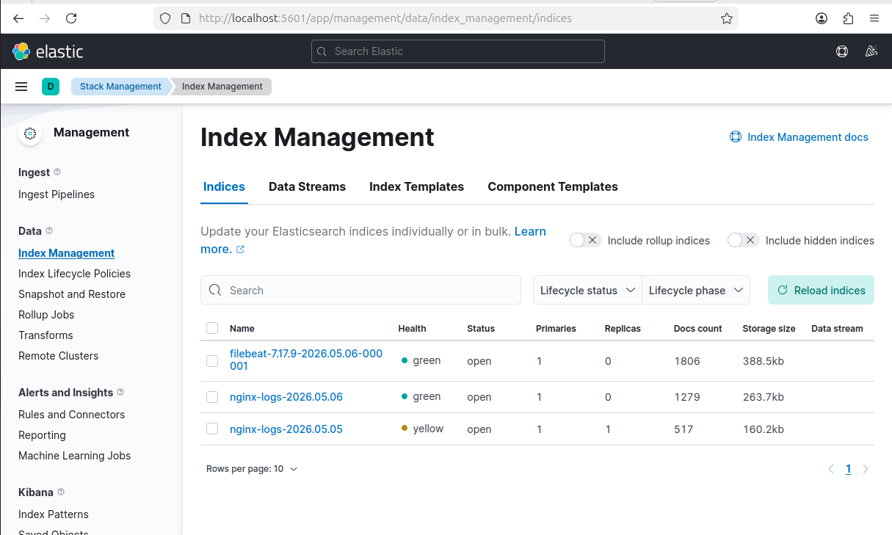

# Домашнее задание к занятию  "ELK"


### Задание 1. Elasticsearch
Установите и запустите Elasticsearch, после чего поменяйте параметр cluster_name на случайный.

Приведите скриншот команды 'curl -X GET 'localhost:9200/_cluster/health?pretty', сделанной на сервере с установленным Elasticsearch. Где будет виден нестандартный cluster_name.

Решение:


---

Задание 2. Kibana
Установите и запустите Kibana.

Приведите скриншот интерфейса Kibana на странице http://<ip вашего сервера>:5601/app/dev_tools#/console, где будет выполнен запрос GET /_cluster/health?pretty.


Задание 3. Logstash
Установите и запустите Logstash и Nginx. С помощью Logstash отправьте access-лог Nginx в Elasticsearch.

Приведите скриншот интерфейса Kibana, на котором видны логи Nginx.








Задание 4. Filebeat.
Установите и запустите Filebeat. Переключите поставку логов Nginx с Logstash на Filebeat.

Приведите скриншот интерфейса Kibana, на котором видны логи Nginx, которые были отправлены через Filebeat.





```


